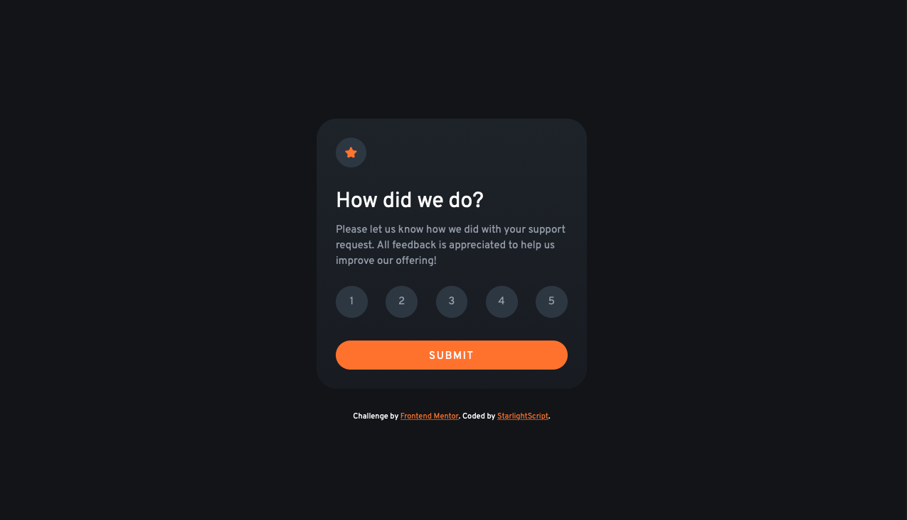

# Frontend Mentor - Interactive Rating Component Solution

This repository contains my solution to the [Interactive Rating Component challenge](https://www.frontendmentor.io/challenges/interactive-rating-component-koxpeBUmI) on Frontend Mentor. The challenge focuses on building a responsive and interactive rating component using HTML, CSS, and JavaScript.

## Table of Contents

- [Overview](#overview)
  - [The Challenge](#the-challenge)
  - [Screenshot](#screenshot)
  - [Links](#links)
- [My Process](#my-process)
  - [Built With](#built-with)
  - [What I Learned](#what-i-learned)
  - [Continued Development](#continued-development)
- [Author](#author)

## Overview

### The Challenge

The primary objectives of this challenge include:

- Ensuring that the rating component offers an optimal layout across various screen sizes.
- Implementing hover states for all interactive elements to provide visual feedback to users.
- Allowing users to select and submit a numerical rating through the component.
- Displaying a "Thank you" card state after the user submits a rating.

### Screenshot

### Links

- [Solution URL](https://www.frontendmentor.io/solutions/interactive-rating-component-built-with-html-css-and-js-vMi8dyY5h8)
- [Live Site URL](https://starlightscript.github.io/Interactive-rating-component/)

## My Process

### Built With

I approached this challenge using the following technologies and methodologies:

- **Semantic HTML5 markup:** Ensuring the HTML structure is meaningful and accessible.
- **CSS custom properties:** Utilizing CSS variables to maintain consistent styling and enhance maintainability.
- **Flexbox:** Creating flexible and responsive layouts.
- **Mobile-first workflow:** Designing and coding for mobile devices first, then adapting for larger screens.
- **Vanilla JS:** Implementing interactivity and dynamic behavior without external libraries.

### What I Learned

Throughout this project, I gained valuable insights into several key areas:

- **Interactive Design:** I learned how to create a user-friendly interactive component, incorporating hover states and click interactions to enhance user experience.
- **Responsive Development:** I honed my skills in designing layouts that adapt seamlessly to different screen sizes and devices.
- **CSS Customization:** By utilizing CSS custom properties, I achieved a more consistent and modular styling approach.
- **Basic JavaScript Logic:** I applied foundational JavaScript concepts to enable the rating selection and dynamic content update.
  
### Continued Development

While completing this challenge was a significant step, I recognize that there's room for further improvement:

- **JavaScript Proficiency:** I aim to deepen my JavaScript knowledge, exploring more advanced techniques and concepts.
- **Advanced CSS:** I plan to delve into advanced CSS features such as CSS Grid and animations to enhance my styling capabilities.
- **Accessibility:** Ensuring that the rating component meets high accessibility standards for a more inclusive user experience.

## Author

- Frontend Mentor - [@StarlightScript](https://www.frontendmentor.io/profile/StarlightScript)

Feel free to reach out to me if you have any questions or feedback about this project! I'm open to suggestions and eager to continue refining my skills.
